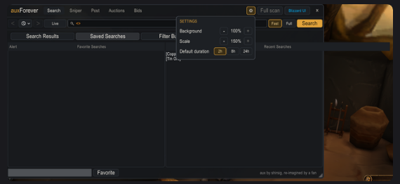

# Player feedback log

Every piece of feedback players give about auxForever is recorded here, one entry per point, so
whoever fixes or builds next (any AI agent or person) can work from it without the original chat.
Started 2026-10-08, on 0.4.1 (the version players have).

## How we read feedback (Tyler, 2026-10-08)

If a player has a problem with auxForever, assume the problem is in the addon, not the player.
Tyler: "If a user downloads our add-on, and they have a problem, it's very likely a problem with
our app and not a problem with them. I'm not going to assume that people are just bad at the
auction house. Our app needs to be so good that they can't help but be good at the auction house
because of the visual clarity we provide, the information we provide, etc."

(Quoted from Tyler's message; it was dictated, and a passage he repeated is given once.)

So:
- "I didn't know you could do X" is a finding about the addon (X is hard to find), not a
  question answered. Record it even when Tyler already explained the feature to the player.
- When a player says they need to get used to something, record what they expected instead.
  That expectation is the design target.
- Never write an entry as "user error". At most, write what the player expected and why the addon
  did not meet it.

## Credit

When a change comes from a player's feedback, its line in `docs/changelog.md` (which is also the
CurseForge changelog) names the player by in-game name: "(suggested by Darkhorse)" for an idea,
"(reported by Darkhorse)" for a bug. Several players: "(reported by Darkhorse and Hotpocket)". The
entry's "From" field says who to credit. Tyler asked for this on 2026-10-08.

## Rules

For whoever records feedback:

- One entry per distinct point. A message with three complaints becomes three entries that share
  the same source.
- Record what the player said **word for word** under "Said", with spelling as given. Never
  improve, shorten or merge quotes. If Tyler retells it instead of quoting, write "Tyler's
  summary:" before it.
- Keep three things apart and labeled: what the player said, what Tyler added, and what the
  recorder infers (likely cause, code area). An inference is never written as a fact.
- Names: the player's in-game character name (Tyler, 2026-10-08: "In game names are fine they
  are very public"). No real names, Discord account IDs, email addresses or other contact details:
  this repository is public. If a player asks not to be named, replace their name in every entry
  with a label ("Player A") and note the change in the commit message.
- Screenshots (Tyler's choice, 2026-10-08): save one in `docs/feedback/` as `FB-<id>-<n>.png` only
  when the picture itself matters to the fix (a layout problem, an error window). Before saving,
  tell Tyler what is visible in it (chat lines, other players' names, his character, guild, gold)
  and crop out what the fix does not need. Every other screenshot is described in words in the
  entry. BugSack error text goes in the entry in full, in a code block.
- Keep the whole conversation, word for word, as a source file in `docs/feedback/sources/`
  (`<date>-<player>-<channel>.md`), and link it from each entry. Entries quote only the part that
  matters; the source keeps the context.
- Fill in the player under "Players" below the first time they appear.
- No follow-up questions to players (Tyler, 2026-10-08: "We wont get this info we need to work
  without it. I dont want to follow up on feedback."). Record what is not known under "Unknowns"
  and how a fix can work without it. Questions for Tyler are fine ("Ask Tyler").
- IDs are never reused or renumbered. Entries are never deleted; a wrong or duplicate entry gets
  status `duplicate` or `wont-fix` with a reason.
- Add the entry to the index table and commit after every batch, so nothing is lost if a session
  ends.

For whoever fixes or builds from it:

- Read `AGENTS.md` and `docs/status.md` first. An entry's "Proposed" fields are suggestions;
  Tyler decides what goes into which version (`docs/roadmap.md`: a patch version is fixes, speed
  and small things only; new features wait for the next minor version; a bad bug gets a hotfix).
- When you take an entry, set its status to `in-progress` with your branch. When done, set
  `fixed` (or `built`) with the version and commit, and add the in-game check to `TESTING.md`.
  Each bug fix comes with a test that fails without the fix (AGENTS.md).
- Do not wait for more from the player; none will come. Read "Unknowns" and build a fix that
  holds whatever the answer would have been (for example, make every way a post can fail say why,
  instead of finding the one cause), or check it yourself in the code, Blizzard's code, or ask
  Tyler to try it in game. Set `needs-info` only while waiting on Tyler.
- Credit the player in the changelog (see Credit above).

## Fields

| Field | Meaning |
| --- | --- |
| Received | Date Tyler passed it on (and when the player said it, if different). |
| From | Player handle; how many players reported the same thing (update when others repeat it). |
| Where | Discord, in game, CurseForge comment, and so on. |
| Source | Link to the full conversation in `docs/feedback/sources/`. |
| Version | auxForever version the player had, if known. Unknown is written "unknown". |
| Type | `bug` (something works wrong), `request` (something new), `ux` (works, but confusing or awkward), `question`, `praise`. |
| Area | Search, Fast mode, Live, Sniper, Buy bar, Post, Auctions, Bids, Recipe search, Filter Builder, Settings, Window, Performance, Install, Other. |
| Severity | Bugs only. `S1`: spends money wrongly, errors over and over, a tab that does not work, or data lost (hotfix per the roadmap). `S2`: wrong, with a way around it. `S3`: small or cosmetic. |
| Said | The player's words, quoted exactly. |
| Steps / setup | What they did, what they expected, what happened, other addons, error text. Only what was reported. |
| Tyler's notes | Anything Tyler added: whether he can reproduce it, his opinion. |
| Recorder's notes | Inferences, marked as such: likely code area, likely cause, related entries, existing docs that touch it. |
| Unknowns | What the report leaves open, and how a fix can work without it. Players are not asked. |
| Ask Tyler | Open questions for Tyler (what he meant, what he has seen himself). |
| Proposed | Recorder's suggestion: `hotfix`, next patch, next minor (`0.5`), `later`, or `none`. Tyler decides. There will be no 0.4.2 (Tyler, 2026-10-08): fixes and small things wait for 0.5 unless they are bad enough for a hotfix. |
| Status | `new`, `needs-info` (waiting on Tyler), `confirmed` (reproduced), `planned <version>`, `in-progress <branch>`, `fixed <version> <commit>`, `built <version> <commit>`, `wont-fix` (with Tyler's reason), `duplicate of FB-n`. |

## Index

| ID | Received | From | Type | Area | Sev | Summary | Status |
| --- | --- | --- | --- | --- | --- | --- | --- |
| [FB-001](#fb-001-the-other-quantity-box-on-the-buy-bar-does-not-look-like-a-place-to-type) | 2026-10-08 | Darkhorse | ux | Buy bar | n/a | The "Other" quantity box does not look like a place to type | new |
| [FB-002](#fb-002-right-click-an-item-in-the-bags-should-load-it-into-the-post-tab) | 2026-10-08 | Darkhorse | request | Post | n/a | Right-click an item in the bags should load it into the Post tab | new |
| [FB-003](#fb-003-clicking-post-sometimes-does-nothing-and-shows-no-error) | 2026-10-08 | Darkhorse | bug | Post | S2 | Clicking Post sometimes does nothing and shows no error | new |
| [FB-004](#fb-004-the-ui-is-the-biggest-issue-closer-to-the-traditional-auction-house-layout) | 2026-10-08 | Darkhorse | ux | Overall | n/a | The UI is his biggest issue; wants it closer to the traditional auction house | wont-fix (direction; Tyler: follow TSM and aux) |
| [FB-005](#fb-005-praise-the-list-of-sellable-items-on-the-left-of-the-post-tab) | 2026-10-08 | Darkhorse | praise | Post | n/a | Praise: the list of sellable items on the Post tab | new |
| [FB-006](#fb-006-after-resizing-and-changing-the-scale-the-recent-searches-header-sticks-out-of-the-window) | 2026-10-08 | Garsterson | bug | Window | S3 | After resizing and changing the scale, the Recent Searches header sticks out of the window | planned 0.5 |
| [FB-007](#fb-007-crafting-cost-in-the-profession-window-anywhere-in-the-world) | 2026-10-08 | Garsterson | request | Recipe search | n/a | Crafting cost in the profession window, anywhere in the world | planned 0.5 |

## Players

Who gives feedback, so a reader can weigh it. Add a player the first time they appear.

- **Darkhorse**: was in Tyler's guild. Thousands of hours in all versions of WoW; he and Hotpocket
  "are always the richest people in the game because they know how to use the auction house"
  (Tyler, 2026-10-08). Used to the traditional auction house, Auctionator and the retail auction
  house (his own words). Tyler: "a high value feedback provider". Asked for recipe search before
  0.4. Inference: his expectations are likely shared by many experienced players.
- **Hotpocket**: was in Tyler's guild; one of the two richest players Tyler knows, for the same
  reason (Tyler, 2026-10-08). Knows the retail "search every ingredient" feature
  (`docs/roadmap.md`, 0.4). Asked for recipe search before 0.4. Spelling of the in-game name not
  yet confirmed (Tyler wrote "Hot Pocket").
- **Garsterson**: Tyler's brother. Found the gear posting error fixed in 0.1.1 (earlier docs call
  him "Tyler's brother"). His feedback so far reaches the log as Tyler's retelling, not his own
  words.

## Entries

Template (copy for each new entry, newest at the bottom):

```
### FB-001: <one-line summary in plain words>

- Received: 2026-10-08
- From: <handle> (1 report)
- Where: <channel>
- Source: <link to docs/feedback/sources/...>
- Version: <forever-0.4.1 | unknown>
- Type: <bug | request | ux | question | praise>
- Area: <area>
- Severity: <S1 | S2 | S3 | n/a>
- Status: new
- Proposed: <hotfix | 0.5 | later | none>

Said:
> exact words

Steps / setup:

Tyler's notes:

Recorder's notes:

Unknowns:

Ask Tyler:
```

### FB-001: The "Other" quantity box on the buy bar does not look like a place to type

- Received: 2026-10-08 (said 2026-10-07)
- From: Darkhorse (1 report)
- Where: Discord, direct message to Tyler
- Source: [source](feedback/sources/2026-10-07-darkhorse-discord.md)
- Version: unknown (0.4.1 was released 2026-10-06)
- Type: ux
- Area: Buy bar
- Severity: n/a
- Status: new
- Proposed: 0.5 (no 0.4.2, Tyler 2026-10-08; a visual change, so mockup first)

Said:
> is there a way to select the number of something you want to buy? or am i locked in to like 1 or
> 5 or 20

> bc now that forever is using some of the retail AH features i don't think you are locked into
> buying stacks anymore

Steps / setup: buying a trade good (a commodity) from the Search tab. He saw the quantity buttons
(1, 5, 20) and did not find a way to type another number.

Tyler's notes: "I knew that Other button sucked", "It's says Other to the right of 20 but it's
not obvious that it's a text field", "Now that I hear you say it I will make that way more
obvious".

Recorder's notes:
- Fact (code): the box exists. For commodities the buy bar shows four quantity buttons sized to
  the item's stack (`quantities` in `auxForever/gui/buy_bar.lua`: 1, the two largest of 5, 10, 20,
  50, 100, 200, 500 below the stack size, and the stack size), then `other_input`: a 56 wide
  numeric edit box whose empty text shows the word "Other" in gray (`other_input.formatter`).
  Typing a number and pressing Enter buys that many (`other_input.enter`).
- Inference: a gray word in a box styled like the buttons next to it reads as a fifth button, not a
  text field. Nothing shows it takes typing until it is clicked.
- Inference: his second sentence is right: Forever sells commodities by unit, so any quantity can
  be bought. Retail's auction house and Auctionator show a plain number box for this, which is what
  he expects.
- Gear is bought one auction at a time; this entry is about commodities only.

Unknowns: which item he was buying, so which four buttons he saw. Does not matter for the fix:
the box looks the same for every item.

Ask Tyler: nothing.

### FB-002: Right-click an item in the bags should load it into the Post tab

- Received: 2026-10-08 (said 2026-10-07)
- From: Darkhorse (1 report)
- Where: Discord, direct message to Tyler
- Source: [source](feedback/sources/2026-10-07-darkhorse-discord.md)
- Version: unknown
- Type: request (Darkhorse expected it to work; see Tyler's notes on a possible bug)
- Area: Post
- Severity: n/a
- Status: new
- Proposed: 0.5 (no 0.4.2, Tyler 2026-10-08)

Said:
> also, being able to right click something in your bags when you're on the sell tab would be
> great since it's something we are all used to

> yea I jsut need to train my eyes to look there instead of my bags

(Tyler asked: "You think it should just be a right click from the bag to populate the post
field?")
> yea since that's how it works normally

(Tyler asked whether right-clicking a bag item on the post screen locked the addon up.)
> i dont remember it doing that. jsut nothing happened

Steps / setup: on the Post tab ("sell tab" in his words), right-clicked an item in his bags.
Expected: the item is loaded for posting, as in Blizzard's auction house and Auctionator.
Got: nothing happened.

Tyler's notes: told him it is Shift-click from the bag on the Post tab. "I want people to easily
be able to do both". Agreed to make right-click work: "I can make that happen", "That's added to
the list". Also: "I think there is a bug in this section though" (see Ask Tyler).

Recorder's notes:
- Fact (code): `auxForever/core/shortcut.lua` hooks `HandleModifiedItemClick` and passes Shift-click
  (only with no chat box open) and Alt-click to the current tab's `USE_ITEM`; the Post tab selects
  the item (`tab.USE_ITEM` in `auxForever/tabs/post/core.lua`). A plain right-click is not handled.
- Fact (code): aux keeps Blizzard's `AuctionHouseFrame` shown but shrunk to 1% and invisible while
  the auction house is open (`set_blizzard_frame_shown` in `auxForever/aux-addon.lua`), because
  hiding it closes the auction house.
- Inference, unverified: in the modern client a right-click on a bag item with the auction house
  open is handled by Blizzard's bag code and goes to Blizzard's own Sell tab. If so, the item may
  have been put into the invisible Blizzard window, which would match "nothing happened" and could
  be the bug Tyler suspects. Check Blizzard's Forever bag code (`ContainerFrame` item button click)
  before building.
- "train my eyes to look there instead of my bags" and Tyler's "I want people to easily be able to
  do both": the bag list on the Post tab is liked (FB-005), and the bags are where his habit
  starts. Both should work.
- Vocabulary: he calls it the "sell tab" (Blizzard's and Auctionator's name); aux calls it "Post".
  Recorder's reading of Tyler's decision in FB-004 (follow TSM and the original aux): keep "Post".

Unknowns: none that block a fix.

Ask Tyler: what bug do you suspect in this section, and have you seen the addon lock up after a
right-click on a bag item yourself? Steps if so.

### FB-003: Clicking Post sometimes does nothing and shows no error

- Received: 2026-10-08 (said 2026-10-07)
- From: Darkhorse (1 report, happened once)
- Where: Discord, direct message to Tyler
- Source: [source](feedback/sources/2026-10-07-darkhorse-discord.md)
- Version: unknown
- Type: bug
- Area: Post
- Severity: S2 (nothing lost; the player is left not knowing why)
- Status: new
- Proposed: 0.5 (no 0.4.2, Tyler 2026-10-08; the silent part: always say why a post did not happen)

Said:
> also one time i tried posting an item and just nothing happened when i clicked post. I forget if
> it was gear that needed to be repaired or something but no error message came up

> i should have investigated more

Steps / setup: clicked Post on the Post tab. Nothing was posted and no message appeared. He does
not remember the item; possibly damaged gear. Happened once.

Tyler's notes: "Okay perfect all of these messages are invaluable and will probably lead to a big
fix. The post tab needs the most work imo". To "i should have investigated more": "It's all good I
think this is more than enough".

Recorder's notes (code facts with locations; the cause in his case is not known):
- `post_auction` in `auxForever/tabs/post/core.lua` can end without a word in three ways: (1)
  `find_item_location` finds no bag slot with the item that is auctionable and not locked, and the
  function returns at once; (2) `C_AuctionHouse.PostItem` or `PostCommodity` returns false and
  only `pending_post` is cleared; (3) the wait loop gives up after 5 seconds (60 with a
  confirmation dialog open) and clears the state.
- Which items are listed: `container_item` in `auxForever/util/info.lua` first requires full
  durability, then, while the auction house is open, replaces that answer with
  `C_AuctionHouse.IsSellItemValid`. So whether damaged gear can appear in the list depends on what
  the game answers; not verified on Forever.
- Inference, unverified: if the game refuses damaged gear, it shows its own red error text at the
  top of the screen; whether Forever does, and whether he would have noticed it, is unknown.
- Whatever the cause, each of the three paths above can tell the player why (for example "This
  item must be repaired first", "Item not found in your bags"). That fix does not need the cause.

Unknowns (no follow-up with the player): the item, whether it was damaged, whether the game showed
red text, and whether an error happened inside the addon (he may not have BugSack). Work without
them: give each of the three silent paths above its own message, and check damaged gear in the
code or ask Tyler to try it (Ask Tyler).

Ask Tyler: can you try posting a damaged piece of gear on Forever and say what happens (listed in
the Post tab or not; what Post does; any red text)?

### FB-004: The UI is the biggest issue; closer to the traditional auction house layout

- Received: 2026-10-08 (said 2026-10-07)
- From: Darkhorse (1 report)
- Where: Discord, direct message to Tyler
- Source: [source](feedback/sources/2026-10-07-darkhorse-discord.md)
- Version: unknown
- Type: ux
- Area: Overall (every tab)
- Severity: n/a
- Status: wont-fix for the direction he asked for (Tyler, 2026-10-08, see below). That the UI is
  too confusing stands, and is the redesign's job.
- Proposed: 0.5 (Tyler's planned redesign; see Tyler's notes)

Said:
> yea the UI is my biggest issue rn

> but that's bc i'm so used to the traditional UI and auctionator / retail AH

> i will stick with and keep trying for sure

> but yea I think working on the UI so that there is less of a dramatic change from the
> traditional UI is a great move. I know that's a ton of work though

Steps / setup: general impression, not one screen. His references: "the traditional UI",
Auctionator, the retail auction house.

Tyler's notes: "Me and my UI designer buddy are working on a massive .5-.6 update". "Agree" (that
the UI is the biggest issue). "My buddy has like a whole design concept laid out. I'll show you
some prototypes soon." "It's still going to be quite transformative, it's geared toward TSM users"
"But it will be more visually simple" "It's too confusing rn". Also told him: "No hard feelings if
you switch back. Everytime I make a big update I'll let you know".

Recorder's notes:
- He blames his habits ("that's bc i'm so used to..."). Under Tyler's rule (How we read feedback,
  above) this is a finding about the addon: an expert auction house player finds it confusing.
- Darkhorse said he will keep using it; Tyler promised to tell him at each big update.

Decision (Tyler, 2026-10-08), on Darkhorse's request for less change from the traditional UI:
"This one I outright reject. This should much more closely resemble TSM and the original aux like
it already does." So the redesign follows TSM and Simon's aux, not Blizzard's auction house or
Auctionator. What is kept from this entry: the UI is too confusing today (Tyler agreed: "It's too
confusing rn") and should be "more visually simple". Darkhorse's smaller, concrete points are
separate entries and are not rejected: FB-001 (typed quantity), FB-002 (right-click from the bags,
which Tyler agreed to), FB-005 (keep the bag list).

Unknowns: which screens confuse him most. Not asked (no follow-up with players); the redesign
works from Tyler's and the designer's judgment.

Ask Tyler: who is the UI designer (a name or handle for the docs), how their designs will reach
the repository (images, a mockup page, Figma), and whether the redesign is 0.5, 0.6 or spans both.

### FB-005: Praise: the list of sellable items on the left of the Post tab

- Received: 2026-10-08 (said 2026-10-07)
- From: Darkhorse (1 report)
- Where: Discord, direct message to Tyler
- Source: [source](feedback/sources/2026-10-07-darkhorse-discord.md)
- Version: unknown
- Type: praise
- Area: Post
- Severity: n/a
- Status: new
- Proposed: none (keep it through the redesign)

Said:
> i do love the list of sellable stuff ont he left too though

Tyler's notes: "Yeah that one I don't take credit for it was an original feature that I love" (it
comes from Simon's aux).

Recorder's notes: the redesign (FB-004) should keep a list of sellable bag items on the Post tab,
alongside right-click from the bags (FB-002).

Unknowns: none.

Ask Tyler: nothing.

### FB-006: After resizing and changing the scale, the Recent Searches header sticks out of the window

- Received: 2026-10-08
- From: Garsterson (1 report)
- Where: told to Tyler; Tyler retold it
- Source: [source](feedback/sources/2026-10-08-garsterson-via-tyler.md)
- Version: unknown (the Scale setting exists since 0.2.1)
- Type: bug
- Area: Window (seen on Search, Saved Searches)
- Severity: S3 (looks broken; nothing lost)
- Status: planned 0.5 (Tyler, 2026-10-08: "Just wrap this into .5, I dont want to make a .4.2")
- Proposed: 0.5

Said (Tyler's summary):
> He had the issue in the screenshot when he, at 100% scale, made the window large, then raised
> the scale to 140%, I think. Then when he shrunk the window, after doing that, he was able to get
> an element to bleed off of the add-on itself, the window of the add-on itself.

Steps / setup (as told; Tyler is not sure of the exact scale):
1. Settings, Scale at 100%. Make the aux window large with the resize corner.
2. Raise Scale to about 140% (the screenshot shows 150%).
3. Shrink the window with the resize corner.
4. Something sticks out past the window's edge.

Screenshot (cropped, added with Tyler's OK): 

What it shows: Search tab, Saved Searches sub tab, the
settings menu open (Background 100%, Scale 150%, Default duration 2h). The window's right edge is
at the close button, but the gray header bar of the "Recent Searches" list runs on past it, about a
fifth of the window's width further, over the game world. The list's two rows ("[Copp...",
"[Tin O...") are cut off by the settings menu, not by the bug. The "Favorite Searches" list on the
left looks right.

Tyler's notes: none beyond the steps.

Recorder's notes:
- Fact (code): the two lists split the Saved Searches area in half by anchors
  (`frame.saved.favorite`, `frame.saved.recent` in `auxForever/tabs/search/frame.lua`), so the
  panels follow the window. Their column headers do not: `gui/listing.lua` sets each header and
  cell to a fixed width (`col:SetWidth(colInfo.width * width)`, with `width` read from
  `contentFrame:GetRight() - GetLeft()`), recalculated only in `Update`, which runs from the
  table's `OnSizeChanged`.
- Inference, unverified: the header kept a width computed for the larger window. Either
  `OnSizeChanged` did not fire for this table when the window shrank (the Saved Searches sub tab
  may have been hidden at the time, or a scale change does not count as a size change), or
  `GetRight`/`GetLeft` gave values from before the change. Why only the right list is affected is
  not known.
- Other tables built on `gui/listing.lua` may do the same: the Post tab's bid and buyout lists
  (`tabs/post/frame.lua`). The search, Sniper, Auctions and Bids tables use
  `gui/auction_listing.lua`, which resizes differently (`fit_rows`); check them too.
- Related, fixed in 0.4.1: the resize corner made the window jump (`frame.lua`, aux's own sizing).

Unknowns: the exact scale and whether the Saved Searches sub tab was open while resizing. A fix
should hold for any order of resize, scale change and sub tab switch: for example recalculate the
column widths when the table is shown and after the scale changes, or size columns by anchors
instead of fixed widths.

Ask Tyler: nothing; the steps are enough to try.

### FB-007: Crafting cost in the profession window, anywhere in the world

- Received: 2026-10-08
- From: Garsterson (1 report)
- Where: told to Tyler; Tyler retold it
- Source: [source](feedback/sources/2026-10-08-garsterson-via-tyler.md)
- Version: unknown
- Type: request
- Area: Recipe search (profession window)
- Severity: n/a
- Status: planned 0.5 (design decided 2026-10-08, see Decisions; mockup before building)
- Proposed: 0.5 (a new feature; the roadmap keeps those out of patch versions)

Said (Tyler's summary):
> He wants there to be a tooltip in a sorry, in the professions menu. If you are out in the world
> and you open up a recipe, you should be able to generate within the profession tab on that recipe
> the price of crafting and the profit based on full scan data. If we're getting all this f- full
> scan data, then we should be using it for things like this.

> So one of his requests is having the total cost of crafting, if you were to purchase it based on
> full scan data anywhere in the world, not necessarily just at the auction house, if that's
> possible.

What is asked: open a recipe in the profession window anywhere (not only at the auction house) and
see what its materials would cost to buy, from prices aux already saved. Garsterson asked for cost
and profit.

Tyler's notes (scope): "Come to think of it, maybe not profit, maybe just cost of crafting based on
the last full scan data. I don't think we need to bloat the user with information when we could
just give them only what they need. We don't want to suffer from feature creep too much." So the
request as Tyler shapes it: **cost only, no profit**. Tyler first said "tooltip", then "in the
professions menu"; where exactly it shows is open (see Ask Tyler).

Recorder's notes:
- Fact (git history): Simon's aux had this for Classic: `core/crafting.lua` added "(Total Cost:
  ...)" to Classic's profession window, each material at its vendor price if a vendor sells it
  without limit, else its usual price (`history.value`); "?" when any material had no price. It
  hooked Classic's frames only, did nothing on Forever, and was removed in 0.4.1 (commit 14eda02,
  "recipe search does this job"). This request brings that idea back for Forever's profession
  window. The removed file is the reference: `git show 14eda02^:auxForever/core/crafting.lua`.
- Fact (code): the 0.4 recipe cost line (`recipe_costs` in `auxForever/tabs/search/recipe.lua`)
  works only after a recipe search at the auction house: it prices materials from that search's
  live auctions or the vendor price. Reading a recipe's materials anywhere works the same way
  (`recipe_parts`, `C_TradeSkillUI.GetRecipeSchematic`).
- Fact (code): aux does not keep "the last full scan" as such. Every scan (full scan, searches,
  Sniper) feeds price history (`auxForever/core/history.lua`): per item, today's lowest buyout seen
  (`market_value`) and up to 11 past daily lows, from which the usual price (`value`) is a weighted
  median. History is saved, so it is there away from the auction house. Vendor prices aux has seen
  are saved too (`info.merchant_buy_info`).
- Inference: "based on full scan data" therefore had to mean one of: the usual price (steady, what
  Simon used), today's lowest, or a new store of the last full scan's prices. Tyler chose the usual
  price (Decisions below). How aux stores prices: `docs/price-data.md`.
- Performance (AGENTS.md): compute the cost only when a recipe is selected, not per frame, and use
  the history cache (`value_and_days`), not unpacking per material.

Unknowns: none that block it; Tyler's decisions below settle the open points.

Decisions (Tyler, 2026-10-08, answering the questions this entry asked him):
1. Where: "A line in the detail panel of the recipe" (as Simon's aux did; not a tooltip).
2. Which price: "usual price. We need to make sure we are communicating this in a low-profile and
   clean way."
3. A material with no price: Tyler left it to Claude: "My general philosophy is to convey as much
   info as we can with as little screen space as we can. [...] My gut says I would like to show
   them at least an idea of how much it will cost. If we somehow are able to convey that one of the
   items is missing price data graphically, isnt it implied that the calculation would be missing
   that amount? [...] Nothing is permanent, we can edit later."

Design (Claude's decision on point 3, with the rest filled in; build from this, mockup first):
- One line in the recipe's detail panel, small text in the label color, for example
  `Materials  1g 24s`. It is the cost of one craft: each material at its vendor price if a vendor
  sells it without limit and that is cheaper, else its usual price (`history.value`), times the
  amount the recipe needs.
- Some materials without a price: show the sum of the priced ones followed by a gray `+`
  (`Materials  1g 24s+`). The `+` says "at least this much", which is what Tyler's gut asked for:
  an idea of the cost, with the gap visible but taking no space.
- No material priced: `Materials  no price yet` in gray. All priced: no marker.
- Hovering the line shows a tooltip: one row per material (name, amount, cost, and where the price
  comes from: "vendor" or "usual, N days"), missing ones as "no price yet", and a first line
  "Usual prices from aux's price history". This is where the price basis is explained, so the line
  itself stays clean (Tyler's "low-profile").
- Not done: marking the material's own icon in Blizzard's reagent list. It would show which one is
  missing at a glance, but it means hooking Blizzard's reagent buttons, which change between game
  versions. The tooltip names it instead. Revisit if players miss it.
- Works anywhere the profession window opens; no auction house needed. Computed when a recipe is
  selected, never per frame (AGENTS.md, Performance).
- How good the number is depends on how the usual price is worked out; see `docs/price-data.md`,
  "Is it the best way?" (one cheap auction can set a day's price; the cheapest unit understates the
  cost of buying many).

## Before this log

Feedback before 2026-10-08 was recorded in other files, not here:

- Two guild testers (Darkhorse, Hotpocket) asked for recipe search, built in 0.4
  (`docs/roadmap.md`, 0.4, "Recipe search"); their concern about memory use led to `/aux memory`
  (0.3.1).
- Tyler's own in-game test results, build by build: `docs/status.md` and `docs/testing-history.md`.
- Tyler's notes for the Sniper rework and the Auctions tab: `docs/roadmap.md`, 0.5.
- Tyler's brother (Garsterson) found the gear posting error fixed in 0.1.1 (`docs/status.md`, Fixed in 0.1.1).
